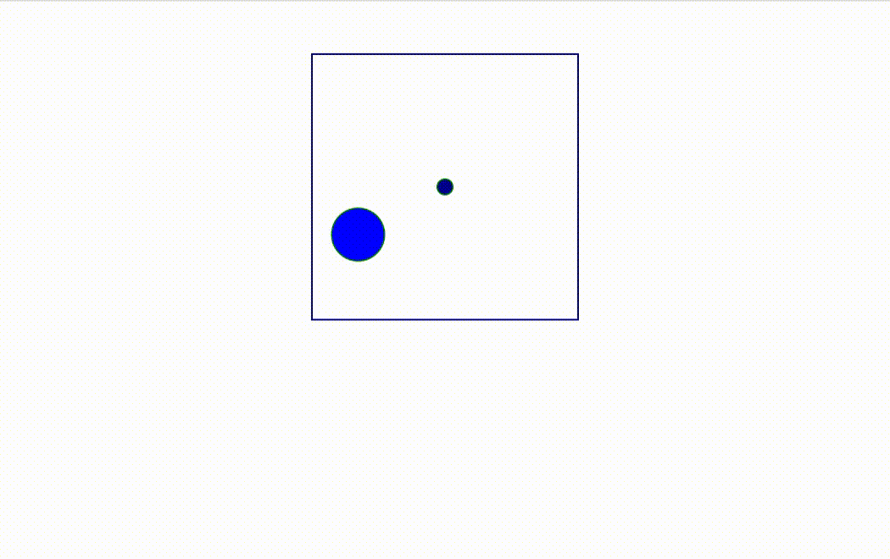

# 📦 p5.wrapper – VanJS Integration

## Installation 

```bash
 npm i ziko p5.wrapper
```

### Cdn : To Do

## API 
### Canvases
 - `P5Canvas2D(...shapes)` : Creates a 2D p5.js canvas container.
 - `P5Canvas3D(...shapes)` :  Creates a webgl p5.js canvas container.
### Shapes 
 - `P5Circle({x, y, r})` : 
 - `P5Box({x, y, z, w, h, d})` : 
## Usage 

```js
import { P5Canvas2D, P5Circle } from "p5.wrapper/van";
import van from "vanjs-core";
import { cos, sin, PI } from "ziko";

const c1 = P5Circle({ r : 40})
             .fill("blue")
             .stroke("green");
const c2 = P5Circle({x:0, y:0, r:50})
             .fill("darkblue")
             .stroke("green");
             
const canvas = P5Canvas2D(c1, c2)
  .style({
    outline : "2px darkblue solid",
    margin : "50px auto"
  })
  .size("250px", "250px")
  .view(-100, -100, 100, 100)
  .setCustomLoopCallback(e => {
    c1.posX(75 * cos((e.iter * PI) / 50));
    c1.posY(75 * sin((e.iter * PI) / 50));
    c2.setRadius(20*(1.5+cos(e.iter * PI/50)))
  });
van.add(document.body, canvas);
```

## Other Implementations
|Library|Implementation|Status|
|-|-|-|
|[Zikojs]()|[p5.wrapper/ziko](../ziko/readme.md)| In Progress
|[React]()|[p5.wrapper/react](../react/readme.md)| In Progress
|[Svelte]()|| To Do 
|[Vue]()|| To Do
|[Solid]()|| To Do 
|[Preact]()|| To Do 

# ⭐️ Show your support 

If you appreciate the library, kindly demonstrate your support by giving it a star !
[](https://github.com/zakarialaoui10/p5.wrapper)
<!--## Financial support-->

# License 
This project is licensed under the terms of MIT License 